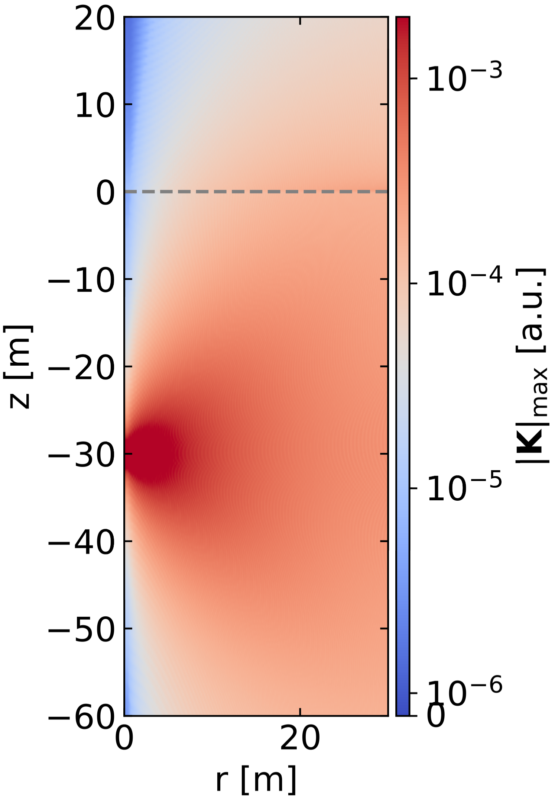

# Antenna Green's function for inhomogeneous medium

This example calculates the Green's function for an inhomogeneous medium (air + ice with smooth refractive index) in a cylindrical geometry. It can serve to test the installation, but is otherwise too simple to be of any real use.

## How to run the example

The example is most suitably run on a batch system (ideally with fast interconnects between the nodes).
For a slurm-managed system, the submission can happen (schematically) with

```
sbatch --nodes 2 --ntasks-per-node 64 --exclusive \
   --wrap "source [ENV_SETUP.sh] && mpirun -np 128 [BUILD_DIR]/examples/dipole_ice/dipole_ice [OUTPUT_DIR] [SCRATCH_DIR]"
```

where `ENV_SETUP.sh` sets up the runtime environment, loads required modules etc.; `BUILD_DIR` is the directory containing the example binaries, `OUTPUT_DIR` is the directory where the final Green's function will show up, and `SCRATCH_DIR` points to a location where temporary files can be placed. It must be accessible from all worker nodes and ideally be fast.

The example will produce of the order of 30GB of data in `OUTPUT_DIR`, and require about twice that in `SCRATCH_DIR`. Runtimes vary depending on system, but should be of the order of 10 minutes.
Below is a plot of the radiation intensity produced by the antenna (at a depth of 30m) in this geometry.

